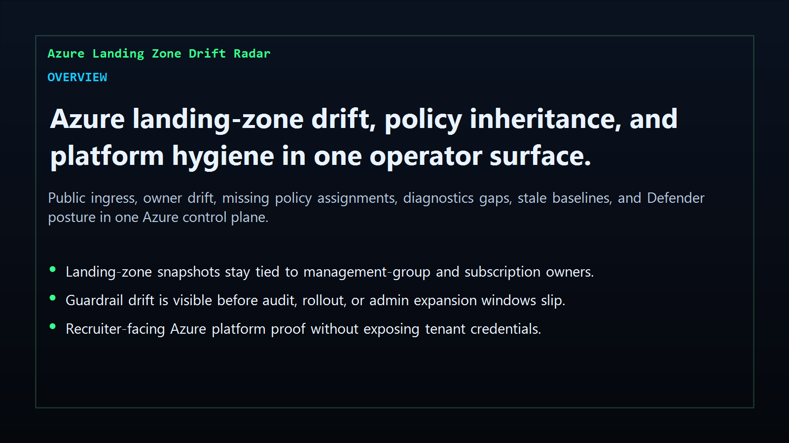
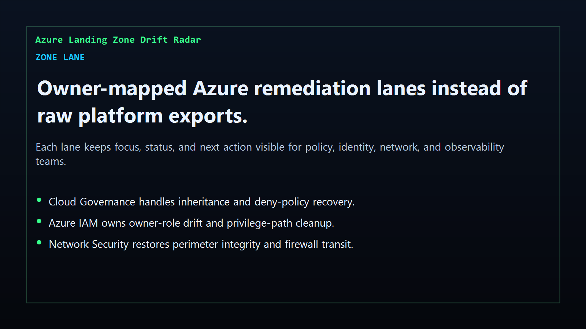
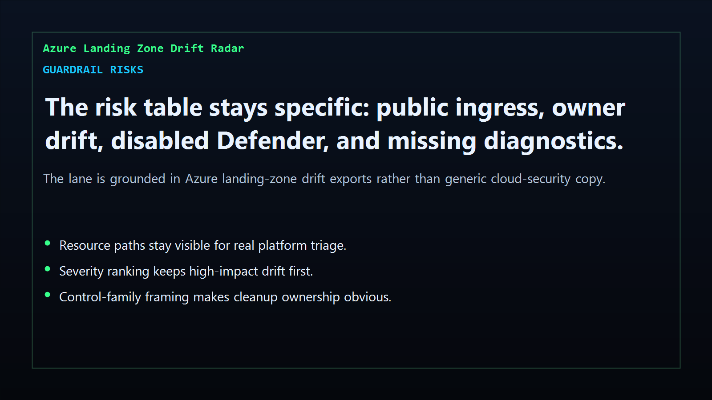
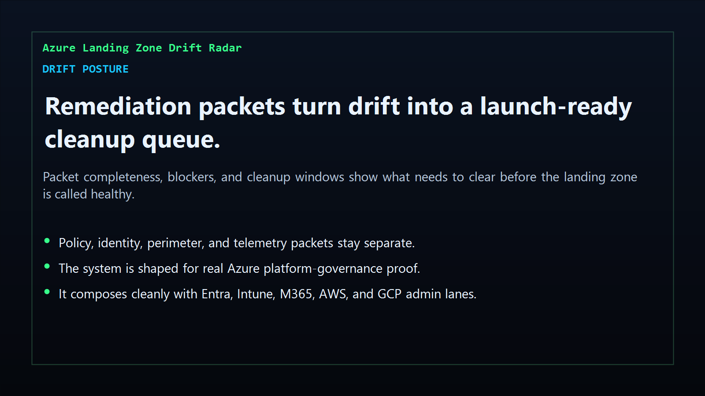

# azure-landing-zone-drift-radar

[](https://github.com/mizcausevic-dev/azure-landing-zone-drift-radar/actions/workflows/ci.yml)
[](./LICENSE)
[](https://github.com/mizcausevic-dev/azure-landing-zone-drift-radar/actions/workflows/pages.yml)

Operator control plane for Azure landing-zone baselines, policy inheritance drift, owner-role changes, network exposure, diagnostics gaps, Defender posture, and remediation sequencing.

## Why this exists

- Azure landing-zone drift becomes dangerous when it stays trapped in policy exports and admin consoles instead of one operator-readable surface.
- Management-group inheritance, direct owner-role grants, perimeter drift, diagnostics coverage, and Defender posture need to stay visible together before audit, rollout, or admin expansion windows slide.
- Recruiters looking for `Azure / Microsoft 365 / Entra / Intune / landing zone / platform engineering` proof should see a real Azure governance dashboard, not a keyword page.
- This repo turns landing-zone baseline and drift data into a control plane for policy guardrails, route integrity, owner-role hygiene, telemetry coverage, and cleanup posture.

## Why this matters (KG Embedded tie-back)

This repo demonstrates the Azure platform-governance control-plane primitive for cloud operations: policy inheritance, owner-role drift, network guardrails, Defender coverage, and baseline freshness in one operator surface. Kinetic Gain Embedded extends this pattern into productized in-app dashboards where platform, identity, and security teams need evidence-rich surfaces without exposing raw admin backends or tenant credentials. See [kineticgain.com/embedded](https://kineticgain.com/embedded).

## What it shows

- `zone-lane` visibility for policy, identity, perimeter, and observability cleanup in one dashboard
- `guardrail-risks` detection for public ingress, direct owner-role drift, missing deny assignments, disabled Defender, diagnostics gaps, and route bypass posture
- remediation packets for policy recovery, owner-role rollback, perimeter repair, and baseline/telemetry refresh
- offline-safe analysis of captured Azure landing-zone drift exports
- recruiter-facing Azure platform / landing zone / management group proof that complements the Microsoft admin, AWS, and GCP cloud lanes

## Product depth

This is not a tenant admin console clone. It is a board- and operator-readable product surface for teams that need to explain whether their Azure estate is still inside the guardrails they promised.

- **Buyer value:** gives platform, cloud security, and identity leaders a compact answer to "where did the landing zone drift, who owns the cleanup, and what has to be fixed before the next audit, expansion, or migration wave?"
- **Technical proof:** parses synthetic baseline snapshots and drift exports into route-level pages, JSON APIs, CLI output, remediation packets, and screenshot-ready proof surfaces.
- **GTM story:** positions Kinetic Gain as the layer between raw Azure exports and executive decisions about cloud governance, cost exposure, security posture, and rollout readiness.

## What these repos have in common

The Azure drift radar follows the same Kinetic Gain pattern used across the cloud, identity, revenue, and regulated-infrastructure surfaces:

- a **risk signal** that turns raw system drift into a readable control weakness
- an **owner context** that keeps accountability attached to a real team or role
- an **evidence packet** that can support audit, diligence, board, or investor conversations
- a **next action** that converts "we should investigate" into a concrete remediation path

## Operating workflow

1. Export or model the current landing-zone baseline and drift observations.
2. Run the analyzer locally or in CI against the captured JSON payload.
3. Review zone lanes, guardrail risks, and remediation posture before the next audit or rollout decision.
4. Use the static site and JSON endpoints as a buyer-readable artifact for platform governance, cloud-security review, or portfolio diligence.

## Routes

- `/`
- `/zone-lane`
- `/guardrail-risks`
- `/drift-posture`
- `/verification`
- `/docs`

## API

- `/api/dashboard/summary`
- `/api/zone-lane`
- `/api/guardrail-risks`
- `/api/drift-posture`
- `/api/verification`
- `/api/sample`

## Screenshots






## CLI

```powershell
npx azure-landing-zone-drift fixtures/azure-landing-zone-drift.json `
    --format json|markdown|summary `
    --now 2026-05-30T00:00:00Z `
    --stale-drift-after-hours 24 `
    --fail-on-high `
    --out report.md
```

Input shape:

```json
{
  "snapshots": [ ... ],
  "drifts": [ ... ]
}
```

## Local Development

```powershell
cd azure-landing-zone-drift-radar
npm install
npm run dev
```

Open:
- [http://127.0.0.1:5516/](http://127.0.0.1:5516/)
- [http://127.0.0.1:5516/zone-lane](http://127.0.0.1:5516/zone-lane)
- [http://127.0.0.1:5516/guardrail-risks](http://127.0.0.1:5516/guardrail-risks)
- [http://127.0.0.1:5516/drift-posture](http://127.0.0.1:5516/drift-posture)
- [http://127.0.0.1:5516/verification](http://127.0.0.1:5516/verification)

## Validation

- `npm run lint`
- `npm run typecheck`
- `npm run coverage`
- `npm run build`
- `npm run demo`
- `npm run smoke`
- `npm run prerender`
- `npm run render:assets`

## Production status

| Aspect | Status |
|--------|--------|
| CI | Node 20 + 22 matrix — lint · typecheck · coverage · build · demo · smoke · prerender · `npm audit` |
| License | [AGPL-3.0-or-later](./LICENSE) |
| Deploy | Static prerender -> **https://zone.kineticgain.com/** |
| Data posture | Synthetic sample data only; no live Azure tenant credentials, subscription secrets, or production exports |
| Suite | Part of the [Kinetic Gain Protocol Suite](https://suite.kineticgain.com/) operator portfolio · apex: [kineticgain.com](https://kineticgain.com) |

## Docs

- [Kinetic Gain Embedded tie-back](./docs/KINETIC_GAIN_EMBEDDED.md)
- [Changelog](./CHANGELOG.md)

## Composes with

- [**`entra-access-review-control-plane`**](https://github.com/mizcausevic-dev/entra-access-review-control-plane) — Microsoft Entra access reviews
- [**`intune-device-compliance-ops`**](https://github.com/mizcausevic-dev/intune-device-compliance-ops) — Intune device compliance
- [**`m365-retention-case-orchestrator`**](https://github.com/mizcausevic-dev/m365-retention-case-orchestrator) — Microsoft 365 retention and case posture
- [**`aws-iam-access-analyzer-console`**](https://github.com/mizcausevic-dev/aws-iam-access-analyzer-console) — AWS IAM analyzer posture
- [**`gcp-iam-policy-diff-lab`**](https://github.com/mizcausevic-dev/gcp-iam-policy-diff-lab) — GCP IAM and org-policy drift

Together they form a broader recruiter-facing cloud admin lane: Microsoft tenant governance plus Azure platform proof and AWS/GCP identity/perimeter evidence.
